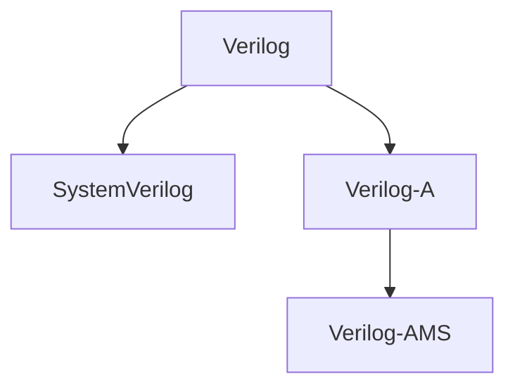

# Verilog-Code

This repository is an effort to make an introduction in SystemVerilog.

Start from Verilog folder first:

Sources that helped me starting learning HDL:

|  No. |                          Sources                              |       Verilog      |    SystemVerilog   |        UVM         |        VHDL        |      SystemC       | 
|:----:|:-------------------------------------------------------------:|:------------------:|:------------------:|:------------------:|:------------------:|:------------------:| 
|   1  | https://fpgatutorial.com/                                     | :heavy_check_mark: | :heavy_check_mark: |                    | :heavy_check_mark: | :heavy_check_mark: | 
|   2  | https://www.doulos.com/knowhow/                               | :heavy_check_mark: | :heavy_check_mark: |                    | :heavy_check_mark: | :heavy_check_mark: | 
|   3  | https://verificationguide.com/                                |                    | :heavy_check_mark: | :heavy_check_mark: |                    | :heavy_check_mark: | 
|   4  | https://www.chipverify.com/                                   | :heavy_check_mark: | :heavy_check_mark: | :heavy_check_mark: |                    |                    | 
|   5  | https://www.systemverilog.in/p/systemverilog-tutorial.html    |                    | :heavy_check_mark: | :heavy_check_mark: |                    |                    | 
|   6  | Digital Design , M. Morris Mano and Michael Ciletti , 6th Ed. | :heavy_check_mark: | :heavy_check_mark: |                    | :heavy_check_mark: |                    | 
|   7  | Digital Design , William J. Dally and R. Curtis Harting       |                    | :heavy_check_mark: |                    |                    |                    | 
|  ... |                            ...                                |         ...        |         ...        |        ...         |         ...        |         ...        |

Additional information:

1. Configuration instructions:
    * No configurations necessary.

2. Installation instructions:
    * I am using VisualStudioCode extensions:
        + https://github.com/mshr-h/vscode-verilog-hdl-support
        + https://www.wavetrace.io/
    * Also I work with Icarus Verilog:
        + official site: http://iverilog.icarus.com/
        + download for windows: https://sourceforge.net/projects/iverilog/
        + other guides: https://iverilog.fandom.com/wiki/Installation_Guide (old)
        + new : https://steveicarus.github.io/iverilog/index.html
3. Operating instructions:
    * Add Icarus Verilog to PATH.
    * Always use flag: -g2012 
4. A file manifest (list of files included):
    > Verilog
    > >
    > > intro
    > >
    > Verilog-A
    > >
    > > intro
    > >
    > Verilog-AMS
    > >
    > > intro
    > >
    > SystemVerilog
    > >
    > > intro
    > >
5. Copyright and licensing information:
    * See sources table.
6. Contact information:
    * git 
    * mail
7. Known bugs:
    * No bugs yet.
8. Troubleshooting:
    * See each folder.

