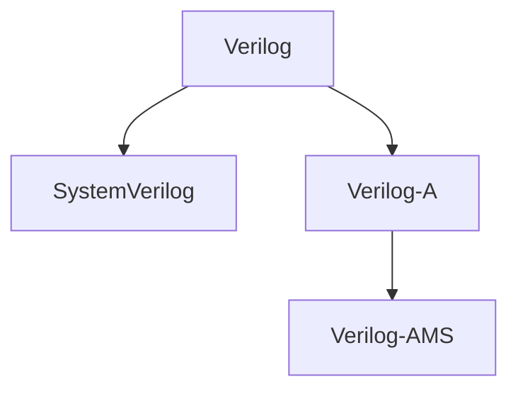

# Verilog-Code
This repository is an effort to make an introduction in SystemVerilog.

Start from Verilog folder first:

Sources that helped me starting learning HDL:

| No. |                          Sources                              |       Verilog      |    SystemVerilog   |        UVM         |        VHDL        |      SystemC       | 
|:----:|:-------------------------------------------------------------:|:------------------:|:------------------:|:------------------:|:------------------:|:------------------:| 
|  1   | https://fpgatutorial.com/                                     | :heavy_check_mark: | :heavy_check_mark: |                    | :heavy_check_mark: | :heavy_check_mark: | 
|  2   | https://www.doulos.com/knowhow/                               | :heavy_check_mark: | :heavy_check_mark: |                    | :heavy_check_mark: | :heavy_check_mark: | 
|  3   | https://verificationguide.com/                                |                    | :heavy_check_mark: | :heavy_check_mark: |                    | :heavy_check_mark: | 
|  4   | https://www.chipverify.com/                                   | :heavy_check_mark: | :heavy_check_mark: | :heavy_check_mark: |                    |                    | 
|  5   | Digital Design , M. Morris Mano and Michael Ciletti , 6th Ed. | :heavy_check_mark: | :heavy_check_mark: |                    | :heavy_check_mark: |                    | 
|  6   | Digital Design , William J. Dally and R. Curtis Harting       |                    | :heavy_check_mark: |                    |                    |                    | 
