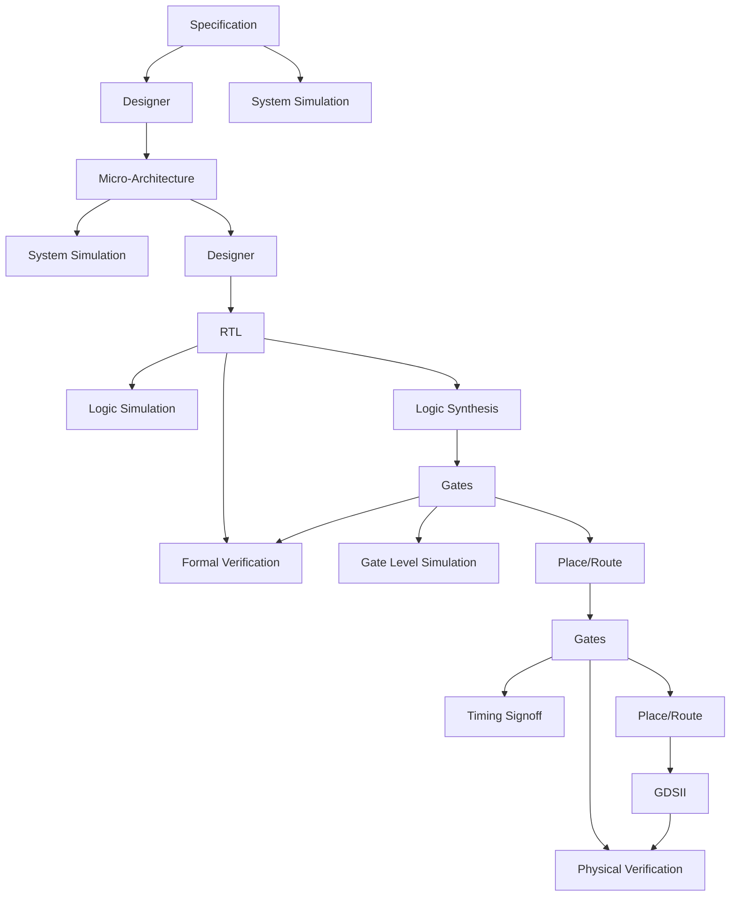

Design Flow:
------------

```mermaid
  graph TD;
    A[Specification]-->B[Designer];
    A-->C[System Simulation];
    B-->D[Micro-Architecture];
    D-->E[System Simulation];
    D-->F[Designer];
    F-->G[RTL];
    G-->H[Formal Verification];
    G-->I[Logic Simulation];
    G-->J[Logic Synthesis];
    J-->K[Gates];
    %% Note right of K: Synthesizable Gates
    K-->H;
    K-->L[Gate Level Simulation];
    K-->M[Place/Route];
    M-->N[Gates];
    %% Note right of N: Placed/Route Gates
    N-->O[Timing Signoff];
    N-->P[Physical Verification];
    N-->Q[Place/Route];
    Q-->R[GDSII];
    R-->P;
```

