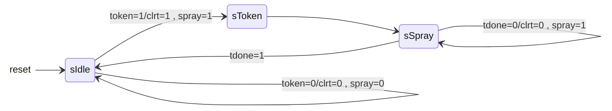

Moore FSM:
----------

Given the followng FSM write the SystemVerilog module and testbench

```mermaid
stateDiagram
    direction LR
    classDef rst fill:white,stroke-width:0px
    reset:::rst --> sIdle
    sIdle --> sIdle : token=0/clrt=0 , spray=0
    sIdle --> sToken : token=1/clrt=1 , spray=1
    sToken --> sSpray
    sSpray --> sSpray : tdone=0/clrt=0 , spray=1
    sSpray --> sIdle : tdone=1
```
